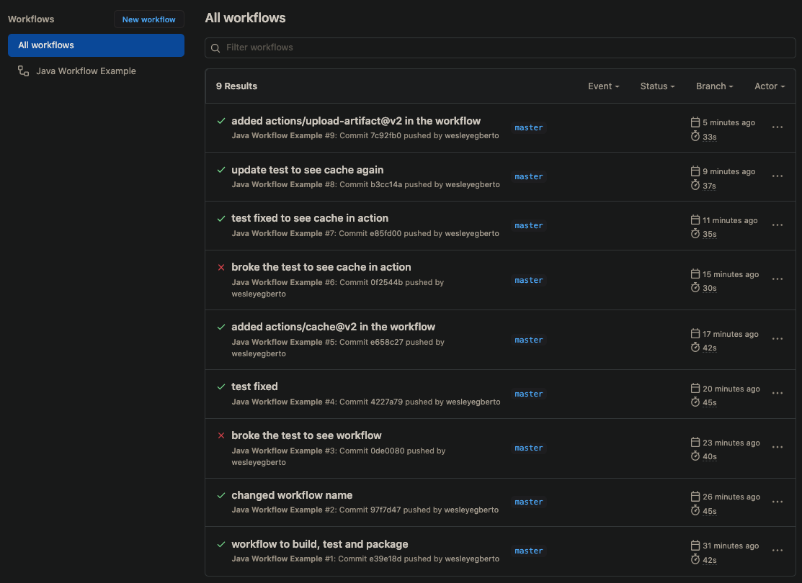

# Github Actions with Java

## Status

<!-- badges -->
[![github-release-badge]][github-release]
[![github-license-badge]][github-license]
<!-- badges -->

<!-- history badges -->
| GitHub Actions |
| -------------- |
| [![github-badge]][github] |
| [![github-history-badge]][github] |
<!-- history badges -->

## Description

Repository to test different Github Actions with Java.

Workflows:

**Java Workflow Example - Build, Test and Deploy**

Simple workflow to build, test and deploy.

- Checkout
- Environment setup:
  - JDK 11
  - Maven packages caching
- Maven build
- Maven test
- Mave deploy to Github Packages
- Upload artifact to Github to be available to download

Example of workflow runs:

**Draft new release**

Manual workflow to create a branch release to be merged if the workflow passes.

- Create a branch with the format `release/x.y.z`
- Build, test and upload the test output to be verified
- After the tests it opens a PR to master to be merged

**Publish new release**

Workflow to release the builds after a branch `release/x.y.z` is merged.

- Create a new release
- Open a PR to develop branch

## Links

- [Github Actions for Java](https://docs.github.com/en/actions/language-and-framework-guides/github-actions-for-java)

[github-release]: https://github.com/wesleyegberto/gh-actions-java/releases/latest
[github-release-badge]: https://img.shields.io/github/release/wesleyegberto/gh-actions-java.svg?logo=github&style=flat "Latest Release"
[github-license]: https://github.com/wesleyegberto/gh-actions-java/blob/master/LICENSE
[github-license-badge]: https://img.shields.io/github/license/wesleyegberto/gh-actions-java.svg?style=flat "License"
[github]: https://github.com/wesleyegberto/gh-actions-java/actions?query=branch%3Amaster
[github-badge]: https://github.com/wesleyegberto/gh-actions-java/actions/workflows/build-test-deploy.yml/badge.svg?branch=master
[github-history-badge]: https://buildstats.info/github/chart/wesleyegberto/gh-actions-java?includeBuildsFromPullRequest=false "GitHub Actions History"
